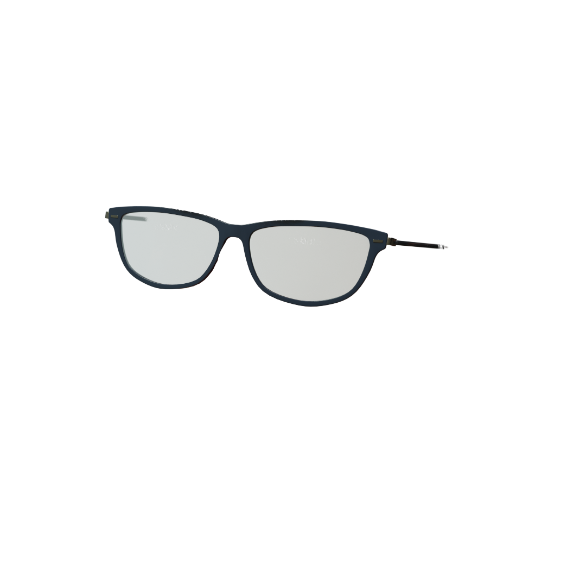

# SD-WebUI-Overlay-PNG

### Overview

**SD-WebUI-Overlay-PNG** is an extension for both [Automatic1111's Stable-Diffusion-Webui](https://github.com/AUTOMATIC1111/stable-diffusion-webui) and **ForgeUI** that allows users to overlay transparent PNG files onto images during the image-to-image (img2img) generation process. The overlay can be applied either during the process or postprocess phase, providing users with greater flexibility and control over the final output.

This extension is also compatible with the **FacePop** project, adding further utility for precise face overlays in complex workflows.

### Example Results

Below is an example of how the **SD-WebUI-Overlay-PNG** extension works:

#### 1. Original Image (Man without Glasses)


#### 2. Overlay Image (Glasses with Transparent Background)


#### 3. Final Combined Result


### Features

- **Overlay Transparent PNGs**: Apply transparent PNG overlays directly in the img2img process for finer control over image manipulation.
- **Supports Both Process and Postprocess**: Users can choose to apply the overlay during the image processing or after the image has been generated (postprocessing).
- **Adjustable Strength**: Fine-tune the strength of the overlay and the mask using sliders to control opacity and blending.
- **Multiple Modes**: Use the overlay in different modes, including:
  - **Image + Mask**: Apply the overlay with a mask for controlled transparency.
  - **Image Only**: Apply the overlay without using a mask.
  - **Mask Only**: Apply only the mask without altering the underlying image.
- **Mask Controls**: Erode or dilate the mask for more precise control, and blur the mask for smooth blending.
- **Hard Mask Option**: Convert the mask to a hard mask, where non-transparent pixels are fully opaque.
- **Positioning and Cropping**: Control where the overlay is applied and even crop or rotate the overlay during postprocess.

### Why I Made This

The img2img pipeline in both ForgeUI and Automatic1111's WebUI lacked a robust and customizable way to overlay transparent PNG files during image generation. While existing tools allowed for basic overlays, this extension introduces a more refined approach with customizable mask handling, adjustable strength, and post-processing options. This is especially useful in workflows like **FacePop**, where precise image overlays are needed for tasks like face alignment, masking, and more.

By providing flexible overlay functionality, users can improve the quality and consistency of image manipulations, particularly in advanced workflows where multiple layers or masks are involved.

### Installation

To install this extension:

1. Clone this repository into the `extensions` directory of your Stable Diffusion WebUI or ForgeUI installation:
   ```bash
   git clone https://github.com/TheCodeSlinger/SD-WebUI-Overlay-PNG.git
   
